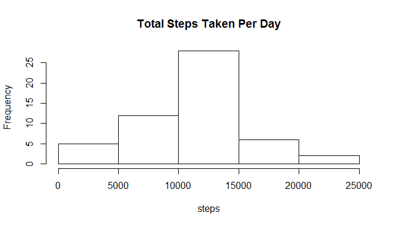
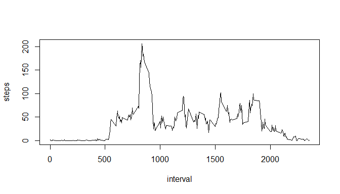
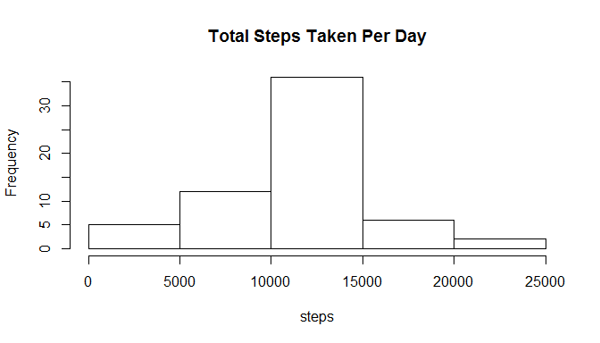
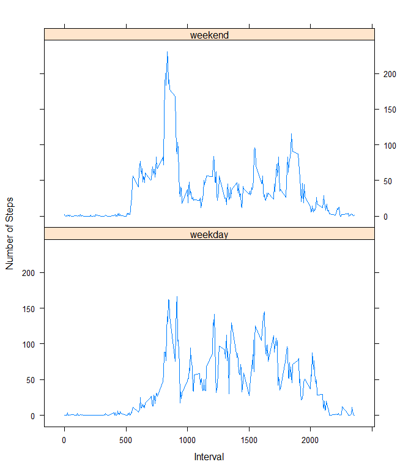

# Reproducible Research: Peer Assessment 1


## Loading and preprocessing the data

Unzip the data and then read data into R


```r
unzip("activity.zip")
activity<- read.csv("activity.csv")
```


## What is mean total number of steps taken per day?

Add up total steps taken by day using


```r
totalsteps<- aggregate(x= activity$steps, FUN= sum, by = list(date = activity$date))
```

Here's the histogram of total steps taken per day

```r
hist(totalsteps$x,xlab = "steps",  main = "Total Steps Taken Per Day")
```

 

## What is the average daily activity pattern?

Calculate mean and median of total steps taken per day

```r
mean<- mean(totalsteps$x, na.rm=T)
median<- median(totalsteps$x, na.rm=T)
print(mean)
```

```
## [1] 10766.19
```

```r
print(median)
```

```
## [1] 10765
```

Calculate average number of steps taken of each interval


```r
stepsinterval<- aggregate(x= activity$steps, FUN=mean, by = list(interval=activity$interval), na.rm=T)
```

Here's the time series plot

```r
plot(stepsinterval$interval, stepsinterval$x, xlab="interval", ylab="steps", type = "l")
```

 

Finding the 5-minute interval that contains the maximum number of steps

```r
maxstep<- stepsinterval[which.max(stepsinterval[,2]),1]
print(maxstep)
```

```
## [1] 835
```


## Imputing missing values

When we want to calculate the number of NA values, we can use is.na function to see which element is NA value and sum it together. Then we know how many NAs are there in the dataframe.


```r
NAs<-sum(is.na(activity$steps))
print(NAs)
```

```
## [1] 2304
```

We use average step of interval to fill in all NA values to create a new data set. we use


```r
library(dplyr)
```

```
## 
## Attaching package: 'dplyr'
## 
## The following object is masked from 'package:stats':
## 
##     filter
## 
## The following objects are masked from 'package:base':
## 
##     intersect, setdiff, setequal, union
```

```r
newdata<- merge(activity, stepsinterval, )
newdata<- mutate(newdata, steps= ifelse(is.na(steps), x, steps))
```

To make histogram of total steps taken each day, we first need to calculate that number.


```r
totalnew<- aggregate(x= newdata$steps, FUN= sum, by = list(date = newdata$date))
```

Then we can make the histogram

```r
hist(totalnew$x, xlab = "steps",  main = "Total Steps Taken Per Day")
```

 

Calculate the mean and median of total number of steps taken per day.


```r
mean1<- mean(totalnew$x, na.rm=T)
median1<- median(totalnew$x, na.rm=T)
print(mean1)
```

```
## [1] 10766.19
```

```r
print(median1)
```

```
## [1] 10766.19
```

The mean of new dataset is the same as the first part of this assignment because we replace the missing value with avergage steps taken. The median of new dataset of different from the original dataset. there is no impact of imputing missing data on the estimates of the total daily number of steps since the mean is the same.

## Are there differences in activity patterns between weekdays and weekends?

To create a new variable indicating whether a given date is a weekday or weekend day, we can mutate function.


```r
Sys.setlocale("LC_TIME", "C")
```

```
## [1] "C"
```

```r
newdata<- mutate(newdata, weekday= ifelse(weekdays(as.Date(date))%in% c("Sunday", "Saturday"), FALSE, TRUE))
```

To calculate the average steps on weekdays and on weekends, we first split the  new data set into to data set and calculate them seperately. After getting average steps of weekdays and weekends, we comebine them together.


```r
weekday<- newdata[newdata$weekday, ]
weekend<- newdata[!newdata$weekday, ]
weekdayAvgSteps <- aggregate(x = weekday$steps,
                             by = list(interval = weekday$interval),
                             FUN = mean, na.rm = TRUE)
weekendAvgSteps <- aggregate(x = weekend$steps,
                             by = list(interval = weekend$interval),
                             FUN = mean, na.rm = TRUE)
weekendAvgSteps$weekday = "weekday"
weekdayAvgSteps$weekday = "weekend"
newAvgStepsPerInt <- rbind(weekdayAvgSteps, weekendAvgSteps)
names(newAvgStepsPerInt) = c("interval", "steps", "weekday")
```

We can then make the panel plot

```r
library(lattice)
xyplot(steps ~ interval | weekday, data = newAvgStepsPerInt, type = "l", xlab = "Interval", ylab = "Number of Steps", layout = c(1, 2))
```

 

